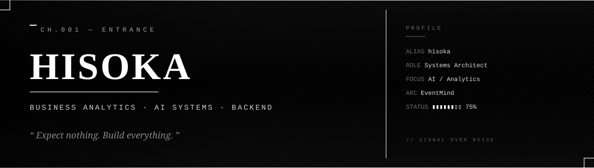

<div align="center">
  
</div>

<br/>

<div align="center">
  <sub>&nbsp;&nbsp;&nbsp;<code>—</code>&nbsp;&nbsp;A character study in systems, restraint, and quiet engineering.&nbsp;&nbsp;<code>—</code>&nbsp;&nbsp;&nbsp;</sub>
</div>

<br/>
<br/>

<!-- ────────────────────────────────────────────────────────────────── -->
## &nbsp;&nbsp;`I.`&nbsp;&nbsp;CHARACTER&nbsp;&nbsp;PROFILE

```txt
┌──────────────────────────────────────────────────────────────────────────┐
│                                                                          │
│   NAME          Hisoka Dsara                                             │
│   ROLE          Backend Engineer  ·  Analyst  ·  AI Systems Architect    │
│   LEVEL         ▮ ▮ ▮ ▮ ▮ ▮ ▮ ▯ ▯ ▯       Mid-Boss                       │
│   CURRENT ARC   EventMind  —  intelligent event orchestration            │
│   LOCATION      Latitude unknown  ·  Timezone: shipping hours            │
│   FOCUS         Data → Signal → Decision → System                        │
│   ALIGNMENT     Pragmatic · Calm · Calculating                           │
│                                                                          │
└──────────────────────────────────────────────────────────────────────────┘
```

<br/>

<!-- ────────────────────────────────────────────────────────────────── -->
## &nbsp;&nbsp;`II.`&nbsp;&nbsp;CURRENT&nbsp;&nbsp;ARC

> The current chapter is not about brilliance. It is about cadence — building
> the kind of systems that no one notices until they are removed.

```txt
  ARC 01  ░  EventMind                  →  Event intelligence platform
  ARC 02  ░  AI Recommendation Systems  →  Behavior → preference → action
  ARC 03  ░  LangGraph Agents           →  Stateful reasoning, not chat
  ARC 04  ░  FastAPI Services           →  Fast, typed, boring on purpose
  ARC 05  ░  G4Z Cup                    →  Competitive analytics, live ops
```

<sub>&nbsp;&nbsp;&nbsp;<code>STATUS</code>&nbsp;&nbsp;In progress.&nbsp;&nbsp;Five threads.&nbsp;&nbsp;One protagonist.</sub>

<br/>

<!-- ────────────────────────────────────────────────────────────────── -->
## &nbsp;&nbsp;`III.`&nbsp;&nbsp;SKILL&nbsp;&nbsp;TREE

```txt
  Python              ██████████████████████   99
  FastAPI             █████████████████████░   95
  AI / LLM Systems    ████████████████████░░   93
  LangGraph / Agents  ███████████████████░░░   88
  Data Analytics      █████████████████████░   96
  SQL  / PostgreSQL   █████████████████████░   94
  Pandas / NumPy      ████████████████████░░   92
  Docker / Compose    ███████████████████░░░   88
  System Design       ███████████████████░░░   87
  Linux / Bash        ██████████████████░░░░   84
  Git / CI Workflows  ███████████████████░░░   88
  Observability       █████████████████░░░░░   80
```

<sub>&nbsp;&nbsp;&nbsp;<code>NOTE</code>&nbsp;&nbsp;Numbers are honest, not flattering. Skills decay if unused.</sub>

<br/>

<!-- ────────────────────────────────────────────────────────────────── -->
## &nbsp;&nbsp;`IV.`&nbsp;&nbsp;FEATURED&nbsp;&nbsp;PROJECTS

<table>
  <tr>
    <td width="50%" valign="top">

```txt
┌──────────────────────────────────┐
│  ◤  EVENTMIND                    │
├──────────────────────────────────┤
│  Intelligent event platform with │
│  recommendation, scoring, and    │
│  real-time analytics for live    │
│  audiences.                      │
│                                  │
│  STACK   FastAPI · PostgreSQL    │
│          LangGraph · Redis       │
│  STATE   active arc              │
└──────────────────────────────────┘
```

</td>
    <td width="50%" valign="top">

```txt
┌──────────────────────────────────┐
│  ◤  G4Z CUP                      │
├──────────────────────────────────┤
│  Competitive analytics layer for │
│  tournament operations — live    │
│  data, scoring pipelines, and    │
│  operator dashboards.            │
│                                  │
│  STACK   Python · SQL · Pandas   │
│          FastAPI · React         │
│  STATE   in production           │
└──────────────────────────────────┘
```

</td>
  </tr>
  <tr>
    <td width="50%" valign="top">

```txt
┌──────────────────────────────────┐
│  ◤  LANGGRAPH AGENTS             │
├──────────────────────────────────┤
│  Stateful, goal-directed agents  │
│  built as graphs — not chat.     │
│  Used inside analytics and       │
│  recommendation flows.           │
│                                  │
│  STACK   LangGraph · LLMs        │
│          FastAPI · Postgres      │
│  STATE   iterating               │
└──────────────────────────────────┘
```

</td>
    <td width="50%" valign="top">

```txt
┌──────────────────────────────────┐
│  ◤  RECOMMENDATION CORE          │
├──────────────────────────────────┤
│  Behavior-driven recommendation  │
│  engine — embeddings, scoring,   │
│  and ranking, with a quiet,      │
│  explainable interface.          │
│                                  │
│  STACK   Python · Embeddings     │
│          PostgreSQL · FastAPI    │
│  STATE   internal alpha          │
└──────────────────────────────────┘
```

</td>
  </tr>
</table>

<sub>&nbsp;&nbsp;&nbsp;<code>ARCHIVE</code>&nbsp;&nbsp;Full repository list →&nbsp;<a href="https://github.com/EgorBelov?tab=repositories">github.com/EgorBelov</a></sub>

<br/>

<!-- ────────────────────────────────────────────────────────────────── -->
## &nbsp;&nbsp;`V.`&nbsp;&nbsp;TELEMETRY

<div align="center">

<a href="https://github.com/EgorBelov">
  
</a>
<a href="https://github.com/EgorBelov">
  
</a>

<br/>

<a href="https://github.com/EgorBelov">
  
</a>

</div>

<sub>&nbsp;&nbsp;&nbsp;<code>READOUT</code>&nbsp;&nbsp;Cards are data, not decoration. Quiet on purpose.</sub>

<br/>

<!-- ────────────────────────────────────────────────────────────────── -->
## &nbsp;&nbsp;`VI.`&nbsp;&nbsp;PHILOSOPHY

```txt
  ─  Build before perfect.            Shipped beats shiny.
  ─  Data over assumptions.           A graph beats a guess.
  ─  Systems over motivation.         Process is the protagonist.
  ─  Consistency beats intensity.     Daily reps compound silently.
  ─  Read the room before the spec.   Context is half the design.
  ─  Quiet code, loud results.        The work should speak first.
```

<br/>

<!-- ────────────────────────────────────────────────────────────────── -->
## &nbsp;&nbsp;`VII.`&nbsp;&nbsp;CONTACT

```txt
  GITHUB     github.com/EgorBelov
  EMAIL      available on request
  STATUS     open to interesting problems  ·  not open to noise
```

<br/>
<br/>

<!-- ────────────────────────────────────────────────────────────────── -->
<div align="center">
  
</div>

<br/>

<div align="center">
  <sub><code>—</code>&nbsp;&nbsp;<i>Expect nothing. Build everything.</i>&nbsp;&nbsp;<code>—</code></sub>
</div>
